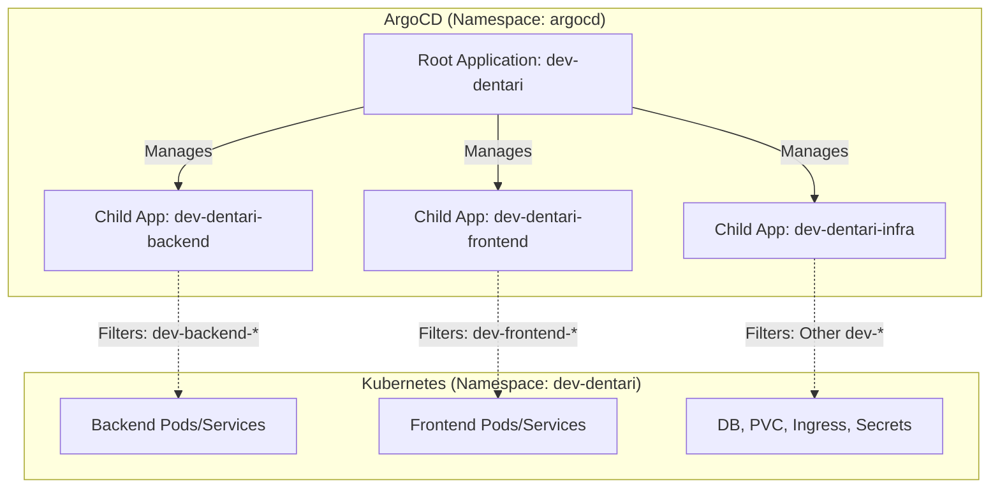

# Dentari Application - K3s Deployment

This directory contains Kubernetes manifests for the Dentari application, organized by environment.

## Architecture

The application is deployed using a multi-service architecture:

- **Frontend**: Streamlit UI (Python)
- **Backend**: FastAPI API (Python)
- **Database**: PostgreSQL 16
- **Observability**: OpenTelemetry Collector (optional)

## Environment Separation

We use folder-based separation for different environments:

- `environments/dev/`: Development environment configurations.
- `environments/prod/`: (Future) Production environment configurations.

## Development Environment (dev)

The development environment uses the `dev-` prefix for all resources and targets the `dev` branch in Git.

### Components

Files are located in `environments/dev/`:

- `dev-namespace.yaml`: Namespace `dev-dentari`.
- `dev-frontend-deployment.yaml`: Streamlit frontend.
- `dev-backend-deployment.yaml`: FastAPI backend with data seeding.
- `dev-db-deployment.yaml`: PostgreSQL database.
- `dev-pvc.yaml`: Persistent volumes for data, logs, and cache.
- `dev-ingress.yaml`: Ingress for frontend and API.
- `dev-secrets.yaml`: Database and API secrets.
- `dev-ghcr-sealed-secret.yaml`: GHCR image pull secrets.

### Setup & Deployment

#### Using ArgoCD (Recommended) - App of Apps Pattern

The application is deployed using the **App of Apps** pattern. The root application manages child applications for different components (Frontend, Backend, Infra) using file filtering.

Apply the root ArgoCD Application manifest:

```bash
kubectl apply -f argocd-apps/demo/dev-dentari.yaml
```

ArgoCD will sync the `main` branch and deploy the following child applications:

- `dev-dentari-backend`: Manages `dev-backend-*.yaml`
- `dev-dentari-frontend`: Manages `dev-frontend-*.yaml`
- `dev-dentari-infra`: Manages all other `dev-*.yaml` supporting manifests.

#### Deployment Architecture



#### Manual Deployment

To replicate the filtering behavior manually:

```bash
# Deploy Infrastructure
kubectl apply -f app/demo/dentari/environments/dev/ -l app.kubernetes.io/component=infra
# Or apply everything at once
kubectl apply -Rf app/demo/dentari/environments/dev/
```

### Environment Variables

Configurations are aligned with `Dentari/.env.dev`:

- `DEPLOYMENT_ENV`: `development`
- `LOG_LEVEL`: `debug`
- `SEED_INITIAL_DATA`: `true` (Backend only)

## Verification

### Check Pod Status

```bash
kubectl get pods -n dev-dentari
```

### Accessing the App

- **Frontend**: [https://dev-dentari.edentlab.hu](https://dev-dentari.edentlab.hu)
- **API**: [https://dev-api-dentari.edentlab.hu](https://dev-api-dentari.edentlab.hu)

---

## Secrets Management

This deployment uses **Sealed Secrets** for GHCR credentials and standard **Secrets** for development-specific sensitive data (e.g., `dev-secrets.yaml`). For production, all sensitive data should be sealed.
