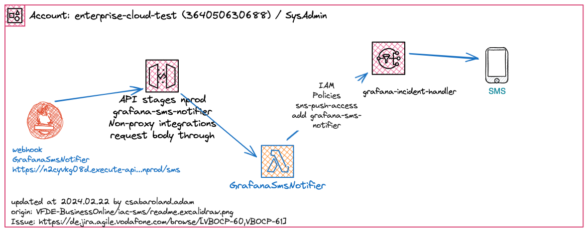
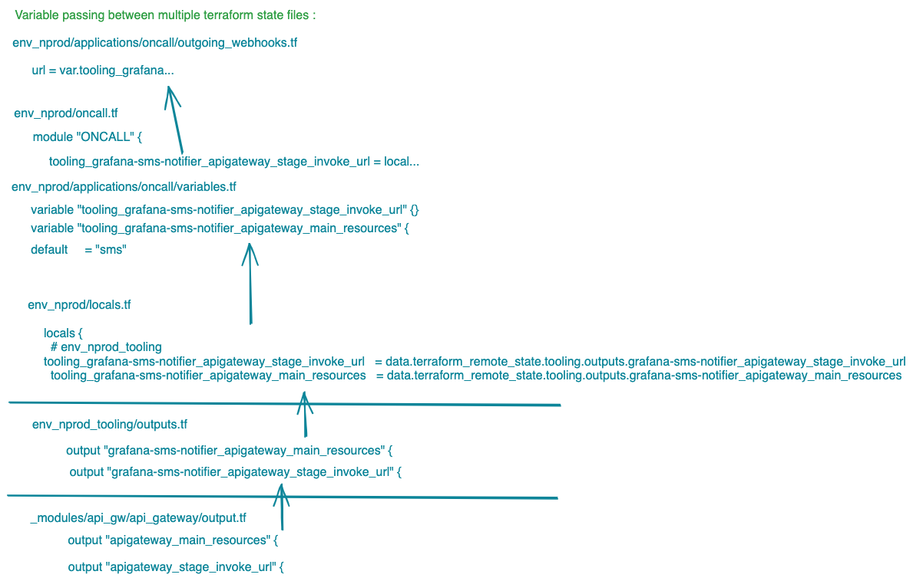
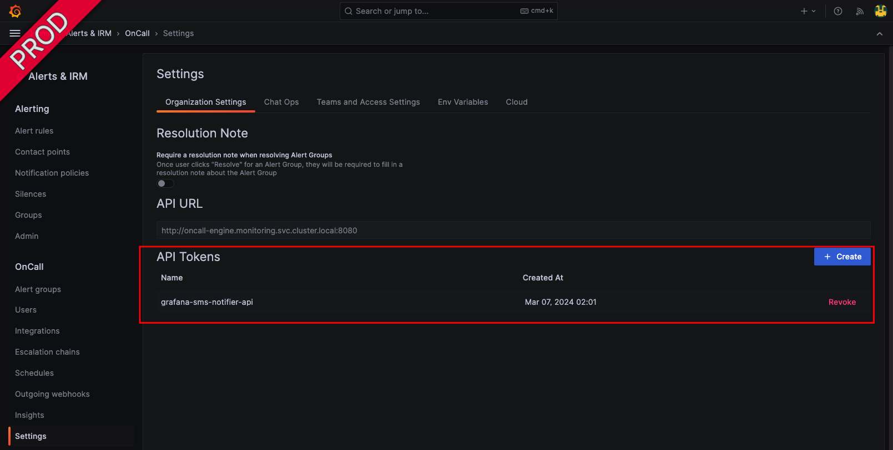
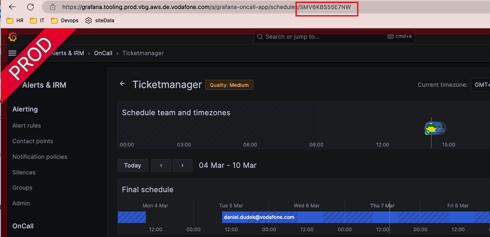
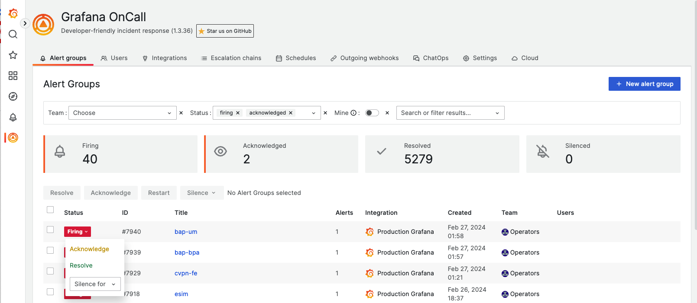
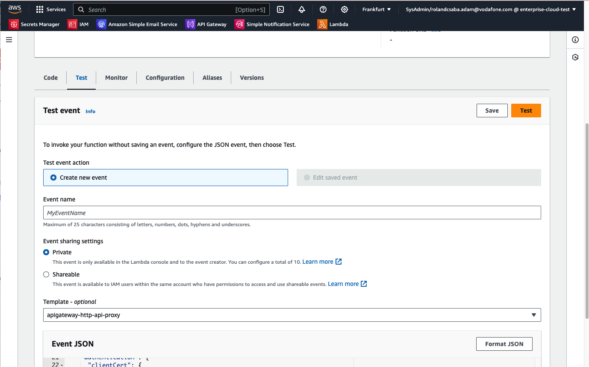

# NON-PROD ENVRONMENT

## Deploy Grafana parts, Amazon API gateway, Lambda by terraform



Currently the terraform codes are hosted under https://github.vodafone.com/VFDE-BusinessOnline/iac

## variables 

Terraform variables are key players in our SMS sending scenario so please analyze above image to better understanding the variable passing between multiple terraform state files



## Prereq : create Grafana scheduled calendar, API key

Grafana Oncall API

- create manually an API token



Grafana Oncall Scheduled calendar

- create manually a scheduled calendar and grab its ID



## Create API GW w/ lambda

iac/env_prod_tooling/grafana_and_oncall/ ✗

- terraform.tfvars

```bash
    whitelist_ips = ADD YOUR EXTERNAL IP ADDRESS HERE
    terraform plan -lock=false -target 'module.SG_ONCALL' # check per environment SG modulename before terraform plan
```

iac/env_nprod_tooling/lambda_source_codes/grafana-sms-notifier ✗

```bash
    saml2aws login --region=eu-central-1 --profile=saml 
    sam build --cached && sam local invoke grafana-sms-notifier -e events/event.json --profile "saml"
```

iac/env_nprod_tooling ✗ 

- lambda-functions.tf  

```bash
    # deploy Lambda to the cloud 
    # here we dont use the previously mentioned sam deploy --guided --profile saml
    # only preferred way to deploy with the following terraform command
    terraform apply -target 'module.GRAFANA_SMS_NOTIFIER_LAMBDA'
    # Manual Step
    # Lambda \ Configuration \ VPC
    # Subnets : search for private (click on the 3 items)
    # Security Groups : search for Oncall (click on only 1 item)
    (only LAMBDA creation && an empty API endpoint)
    terraform apply -target 'module.GRAFANA_SMS_NOTIFIER_API'
    (complete API created)
```

## Integrate API GW w/ Lambda into Grafana

iac/env_nprod ✗

- env_nprod/applications/oncall/chains.tf
- env_nprod/applications/oncall/escalation_sms.tf
```bash
    # Manual Step
    Cannot be applied. -> There is a bug!
    @link: https://github.com/grafana/terraform-provider-grafana/issues/1012
```
- env_nprod/applications/oncall/integrations.tf
- env_nprod/applications/oncall/webhooks.tf

    url = CHANGE_ME_TO_API_GW_URI

- env_nprod/applications/oncall/webhook/sms_alert.jinja2

```bash
    terraform plan -lock=false -target 'module.SG_GRAFANA_ONCALL
    terraform plan -lock=false -target 'module.ONCALL'
```

# TBD

- Iac Manual Step(s)
    - Oncall \ Settings \ create API token --> python my oncall APIKEY
    - app.py --> python my oncall APIKEY
    - env_nprod/applications/oncall/escalation_sms.tf


## testing

Grafana firing an alert



Grafana Oncall API test

```bash
# NON-PROD
curl "https://***/api/v1/schedules/S1FJVXUFK34YV/final_shifts?start_date=$(date -Idate)&end_date=$(date -v+1d -Idate)" --request GET --header "Authorization: 09c89dc33f45f61cb9e50e090c323cd4c44c13b86697e166b60939db15c8ad50" --header "Content-Type: application/json" | json_pp
```

Grafana Oncall webhook SMS

    with template 
    (see example here iac repo>env_nprod/applications/oncall/webhook/sms_alert.jinja2 )


API

    with LAMBDA resource's template apigateway-http-api-proxy

LAMBDA



    with template apigateway-http-api-proxy

