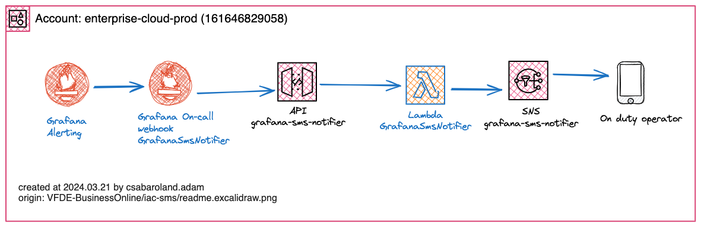

# Grafana OnCall SMS Alert



By default grafana has inbuilt support for sending alerts in various platforms like discord, slack, email, telegram, etc. All of these platforms need internet to function. It would be really great if we could receive alert even if we didnt have internet connection available.

In this guide we will learn how to setup our Amazon API gateway with Lambda python and configure grafana webhook to connect with our API and send SMS alert through Amazon SNS.

Furthermore, we will learn how to develop on Macos locally an AWS lambda python function. We will also learn howto deploy the whole infrastructure by terraform.

You can always find an updated HLD documentation at this location 

For all of this, you will need an AWS account and some development tools (docker, aws,saml2aws, aws-sam-cli, tfenv, gh).

## Scaffold your local Macos development environment

### container development environment

```bash
install the latest Docker Desktop for Mac
# optional
# create dockerfile
# create .dockerignore
```

### aws, saml2aws, lambda development tools

```bash

brew install saml2aws # for aws saml authentication
saml2aws login --force --region=eu-central-1 --profile=saml # login w/ your vodafone user
saml2aws script # list locally created aws variables
brew install awscli  # for managing aws cloud
# optional
# aws configure list
# aws configure list-profiles
# aws sts get-caller-identity
# aws --profile saml s3 ls
brew tap aws/tap # local lambda development
brew install aws-sam-cli # local lambda development
```


### python local development environment

```bash
brew install gh # github cli
clone repository
cd repository
create docs/readme.excalidraw.png # load this from https://excalidraw.com/ ;)
create .gitignore
create .github/workflows folder w/ necessary files
# install app required python version
pyenv install 3.9.18
# To set a project Python version that is active as soon as you “cd” into the project directory
# This will create the file .python-version that contains the [PYTHON_VERSION]
pyenv local 3.9.18
# optional 
# pyenv versions
# python --version

# You can even check that by entering pyenv versions, and it will tell you based on what setting the currently active Python version was selected.
# Make sure you set your desired Python version for this project using pyenv local [PYTHON_VERSION] then enter:
python -m venv .venv 
source .venv/bin/activate

# vscode open the workspace settings.json
"python.terminal.activateEnvironment": true
Python: Select Interpreter --> pyenv local TBD

pip install -r requirements.txt 
create .envrc # pip install direnv : if cd into DIR than auto load ENV from this file 
echo 'layout python' > .envrc # The prompt is not modified though, so we won't see the name of the environment written at the beginning.
create .env
```

### develop aws lambda locally

```bash
# have to login to our AWS environment
saml2aws login --force --region=eu-central-1
# build lambda package
sam build 
# run it by locally
sam local invoke grafana-sms-notifier -e events/event.json --profile saml --env-vars env.json
# deploy to the cloud
sam deploy --guided --profile saml
```

### terraform cli

```bash
brew install tfenv
tfenv install 1.3.6 # currently (2024.01.18) supported terraform version at Vodafone
```

## [link -> Deploy NON-PROD Grafana parts, Amazon API gateway, Lambda by terraform](./README-NON-PROD.md)

# BEGIN_TF_DOCS

<!-- BEGIN_TF_DOCS -->
## Requirements

No requirements.

## Providers

No providers.

## Modules

No modules.

## Resources

No resources.

## Inputs

No inputs.

## Outputs

No outputs.
<!-- END_TF_DOCS -->