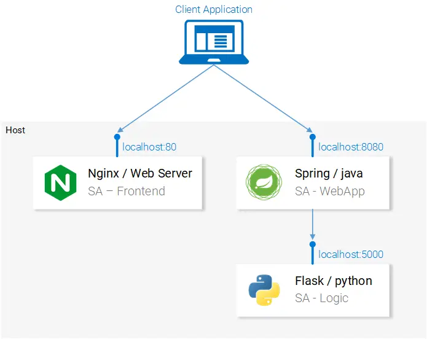
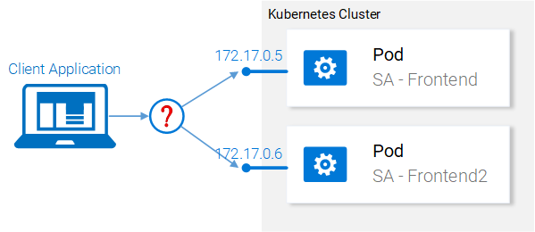
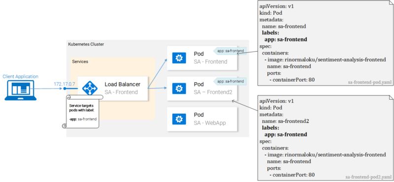
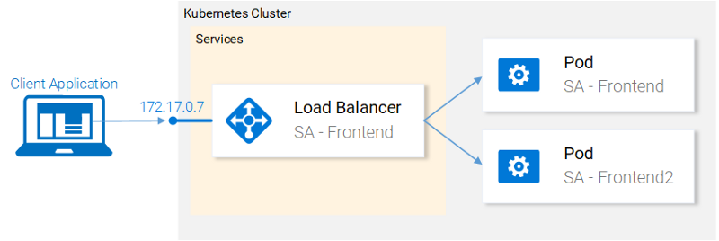

# 1. rész: Kiindulás a microservices alkalmazásokból

https://www.shiwaforce.com/blog/devops/2018/05/24/kubernetes-3-ora-alatt-kiindulas-mikroszervizes-alkalmazasokbol/



# root settings

```bash
.gitignore # make sure you include sub-dirs also
.envrc # eval "$(direnv hook zsh)"
.psenvrc
```

# SA-frontend

```bash
cd sa-frontend
npm install
npm start
npm run build
mv sa-frontend/build sa-fontend/public
http://localhost:80
```

# sa-webapp

```bash
cd sa-webapp
mvn install
cd target
java -jar sentiment-analysis-web-0.0.1-SNAPSHOT.jar
   --sa.logic.api.url=http://localhost:5000
```

# sa-logic

```bash
cd sa-logic/sa
python -m venv .venv
.\.venv\Scripts\activate
    pip install . 
    pip install pandas argparse fuzzywuzzy python-dotenv 
    pip install -r requirements.txt 
    python -m textblob.download_corpora
    pip freeze -l > requirements.txt 
    python sentiment_analysis.py --debug run
```

# 2. rész: konténerekbe szervezés

https://www.shiwaforce.com/blog/devops/2018/06/18/kubernetes-3-ora-alatt-reszletes-utmutato-2-resz-kontenerekbe-szervezes/

## sa-logic

```bash
cd sa-logic
.dockerignore
#sops --encrypt --age $(cat $SOPS_AGE_KEY_FILE |grep -oP "public key: \K(.*)") --in-place .env
.env # Powershell: $env:VARIABLE="VALUE"
Makefile
Dockerfile
# docker login -u="$DOCKER_USERNAME" -p="$DOCKER_PASSWORD"
sudo docker build --no-cache -t $DOCKER_USER_ID/sentiment-analysis-logic .
docker push $DOCKER_USER_ID/sentiment-analysis-logic
docker pull $DOCKER_USER_ID/sentiment-analysis-logic
docker run --name sa-logic -it -d -p 5050:5000 $DOCKER_USER_ID/sentiment-analysis-logic
#sops --decrypt --age $(cat $SOPS_AGE_KEY_FILE |grep -oP "public key: \K(.*)") --in-place .env
# docker exec -it $DOCKER_USER_ID/sentiment-analysis-logic /bin/bash
# docker container inspect $DOCKER_USER_ID/sentiment-analysis-logic
# http://localhost:5050
```

## sa-webapp

```bash
cd sa-webapp
.dockerignore
.env # Powershell: $env:VARIABLE="VALUE"
#sops --encrypt --age $(cat $SOPS_AGE_KEY_FILE |grep -oP "public key: \K(.*)") --in-place .env
Makefile
Dockerfile
# docker login -u="$DOCKER_USERNAME" -p="$DOCKER_PASSWORD"
sudo docker build --no-cache -t $DOCKER_USER_ID/sentiment-analysis-webapp .
docker push $DOCKER_USER_ID/sentiment-analysis-webapp
docker pull $DOCKER_USER_ID/sentiment-analysis-webapp
docker run --name sa-webapp -it -d -p 8080:8080 -e SA_LOGIC_API_URL='http://<container_ip or docker machine ip>:5000' $DOCKER_USER_ID/sentiment-analysis-webapp
#sops --decrypt --age $(cat $SOPS_AGE_KEY_FILE |grep -oP "public key: \K(.*)") --in-place .env
# docker exec -it $DOCKER_USER_ID/sentiment-analysis-webapp /bin/bash
# docker container inspect $DOCKER_USER_ID/sentiment-analysis-webapp
# http://localhost:8080
```

## sa-frontend

```bash
cd sa-frontend
.dockerignore
.env # Powershell: $env:VARIABLE="VALUE"
#sops --encrypt --age $(cat $SOPS_AGE_KEY_FILE |grep -oP "public key: \K(.*)") --in-place .env
Makefile
Dockerfile
docker login -u="$DOCKER_USERNAME" -p="$DOCKER_PASSWORD"
sudo docker build --no-cache -t $DOCKER_USER_ID/sentiment-analysis-frontend .
docker push $DOCKER_USER_ID/sentiment-analysis-frontend
docker pull $DOCKER_USER_ID/sentiment-analysis-frontend 
docker run --name sa-frontend -it -d -p 80:80 $DOCKER_USER_ID/sentiment-analysis-frontend
#sops --decrypt --age $(cat $SOPS_AGE_KEY_FILE |grep -oP "public key: \K(.*)") --in-place .env
# docker exec -it $DOCKER_USER_ID/sentiment-analysis-frontend /bin/bash
# docker container inspect $DOCKER_USER_ID/sentiment-analysis-frontend
# http://localhost:80 
```

## Bonus — Makefile

Let’s create a simple Makefile that allows us to build, run, and kill our image/container:

```bash
app_name = gunicorn_flask
build:
    @docker build -t $(app_name) .
run:
    docker run -d -p 8000:8000 $(app_name)
kill:
    @echo 'Killing container...'
    @docker ps | grep $(app_name) | awk '{print $1}' | xargs docker stop
```

Now we should be able to run:

```bash
# build Docker image
make build
# run the container
make run
# destroy it
make kill
```

## Create a python test environment from scratch

do the above steps to create a virtual environment:

```bash
mkdir test
```

test_hello.py

```bash
def test_failing():
    assert True == True
```

pytest

# 3. Rész: pod-ok létrehozása NOTE: hiányosságokat “Deployments”-el oldjuk meg (pl.: nem kell manuálisan pod-okat elindtani)

https://www.shiwaforce.com/blog/devops/2018/10/18/kubernetes-3-ora-alatt-reszletes-utmutato-3-resz-kubernetes/



# egyenlőre manuálisan hozunk létre pod-okat, és kube-forward-al érjük el; később pedig deployments-el

# sa-frontend pod létrehozása

```bash
cd resource-manifests/sa-frontend-pod.yaml
kubectl create -f sa-frontend-pod.yaml # POD-1
kubectl port-forward sa-frontend-pod 88:80
http://127.0.0.1:88
kubectl create -f sa-frontend-pod2.yaml # POD-2
# Figyelem: ez nem a végleges megoldás, ráadásul számos gyenge pontja is van.
# Később kijavítjuk ezeket a hiányosságokat a “Deployments” Kubernetes-es részben.
```

# 4. rész: szolgáltatások (Services)

https://www.shiwaforce.com/blog/devops/2018/11/20/kubernetes-a-gyarkorlatban-szolgaltatasok-services/

## Create pods w/ labels

Jó kérdés, hogy a Service vajon honnan tudja, mely pod-ot/okat kell megszólítani?

Az ábrán azt látjuk, hogy a pod-ok egy “app: sa-frontend” címkét kaptak és a service az ilyen label-ekkel ellátott pod-okat használja.



```yaml
kubectl apply -f sa-frontend-pod.yaml
kubectl apply -f sa-frontend-pod2.yaml
kubectl get pod -l app=sa-frontend
```

## Create service w/ selector labels


```yaml
kubectl create -f service-sa-frontend-lb.yaml
kubectl get svc
```

# 5. rész: a Deploymentek

https://www.shiwaforce.com/blog/devops/2018/11/20/kubernetes-a-gyakorlatban-a-deploymentek-2/

Most javítjuk ki a manuálisan létrehozott pod-okat, és kube-forward-ot

A Kubernetes-be implementált “Deployment” funkció abban segít minket, hogy szembenézzünk az alkalmazásokat érintő egyetlen állandó ténnyel, azzal, hogy az alkalmazások mindig változnak.

Voltaképpen azok az alkalmazások, amelyek nem változnak folyamatosan gyakorlatilag halottnak tekinthetők.

elenleg két pod-unk van és egy szolgáltatásunk, amely egy load balancer segítségével elérhetővé teszi a pod-okon futó alkalmazást a felhasználók számára (Lásd a lenti ábrát).

Korábban említettük, hogy a pod-ok telepítése külön-külön egyáltalán nem tökéletes, nem ideális.

Hiszen külön kell kezelnünk őket minden egyes lépésben (create, update, delete, sőt a monitorozásukat is külön meg kell oldani).

Gyors frissítéseket és visszaállításokat tehát nem lehet megoldani ezzel a megoldással. Ez nem elfogadható. Erre ad megoldást a Kubernetes “Deployment” funkciója.


